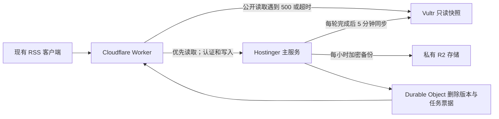

# RSS 双机容灾部署记录

2026-10-06：第一阶段已部署。正式 `rss.qiaomu.ai/api/*`、`/media/wechat/*` 已接入 Cloudflare Worker；Hostinger 为唯一写入节点，Vultr 提供独立只读公开内容副本。

## 已实现

- 原客户端地址保持不变，无需发布 Obsidian 插件版本。
- 自动切换仅覆盖匿名公开 GET/HEAD：源列表、文章列表、源分页、正文、改写、翻译，以及已复制的签名微信图片。登录、投稿、删除、带 Cookie/Authorization 的读取均只访问主机，不重放写入。
- 主机 500/502/503/504、520–524、连接失败、5 秒超时或无效 JSON 才尝试备用；404/403/401/429 不重试。备用预算 4 秒，正文读取和大小校验纳入预算。
- 独立 Python 标准库只读服务，SQLite `mode=ro&immutable=1`，低权限用户、384 MiB 内存上限、50% CPU 上限。副本没有账号、管理员、AI 密钥、抓取调度和图片签名密钥。
- SQLite 在线一致性备份生成公开投影；受限 SSH 密钥只能同步指定暂存目录和校验发布。校验 SHA256、SQLite 完整性、三张公开数据表后原子切换，保留上一代。
- 删除、管理修改、源可见性修改先增加强一致版本并立即禁用旧快照；新快照发布前后都检查版本。请求中断或服务错误保留未结束票据，需查明结果后人工处理，禁止盲目清除。
- 私有完整备份包含原 SQLite、JSON、图片、生产代码/锁文件及恢复配置。AES-256-CBC/PBKDF2 加密并 HMAC 认证，分块上传私有 R2；重新下载、认证、解密和 SQLite 校验后才记录成功。备份密码在运维 Mac 有独立副本，源码无秘密。
- R2 保留最近 24 小时、14 个每日点和 8 个每周点；备机本地仅保留当前与上一代。同步每轮结束后等待 300 秒，因此正常数据落后时间还包含任务耗时，不能承诺严格 5 分钟 RPO。
- 两机每 15 分钟检查磁盘/备份时效，85% 或可用空间低于 5 GiB 记失败；同步空间低于 2 GiB 拒绝导出。新回源日志每日轮转、最多 7 份且单份触发阈值 20 MiB。

## 验证证据

- 首个快照 `s1791289406798`：5,817 篇公开文章，99 个源，删除版本 0。
- 主备抽查源列表、前 100 篇文章顺序、3 篇正文/改写/翻译、源分页及下一页一致；10 个并发读取通过。
- 在受控预览入口模拟主机失败，实际 HTTPS 读取 Vultr：500 约 1.20 秒；超时约 5.48 秒；无效 JSON 约 0.47 秒。演练没有停主机，不能等同于断电演练。
- 首个 R2 备份已从云端重新下载并恢复校验，`restoreVerified=true`。另提供独立恢复命令，只恢复到新隔离目录，绝不自动启动写入节点。
- 11 项 Node 测试、12 项 Python 测试通过，覆盖权限、重试边界、删除竞态、快照代次、只读 DB、私有表拒绝、损坏校验、图片密钥路径拒绝与备份保留。
- 已用不存在的管理路径 DELETE 验证线上票据：版本由 0 变为 1，旧快照立即拒绝故障读取；未删除任何文章。
- 独立恢复 CLI 也已从 R2 成功恢复到隔离目录。
- 回源域名 TLS、Worker 正式路由、定时同步与容量检查已部署。DNS 更新有缓存传播时间，生效后的接口可由 `X-Rss-Origin: primary/standby` 判断来源。

## 清理与容量

主机此前已按授权清理 GitLab、`/tmp/rscan`、`/tmp/leju` 等。备用机本轮清理约 1.7 GiB：归档 journal、软件包缓存、旧 Agent 镜像和旧 sing-box 安装目录，保留所有运行产品和数据卷。

最近核查主机约 54 GiB 可用，备用机约 14 GiB 可用。相较先前核查出现的额外容量变化未全部由本任务产生，不能都归为本轮清理收益。备机 RSS 进程实测约 28 MiB；现有 RSSHub 与 Agent 容器仍健康。

## 边界与后续

此阶段保障公开阅读。网站静态外壳、账号/私人数据、播客实时逐字稿依赖与写入接管未做自动容灾。主机恢复后每个请求重新优先访问主机；未引入全局熔断或整机永久摘除。

容量和过期检查已记录在 systemd；尚未配置外部消息告警接收渠道。若 Cloudflare 本身不可达，仍依赖客户端缓存。快照超过 24 小时或发生未解决删除票据时停止备用读取，以保护内容可见性。

完整部署、故障演练、票据处理、备份恢复、主机隔离和路由回退步骤见 [运维手册](../server/dr/README.md)。方案依据：[Cloudflare 路由文档](https://developers.cloudflare.com/workers/configuration/routing/routes/)与[平台限制](https://developers.cloudflare.com/workers/platform/limits/)。
